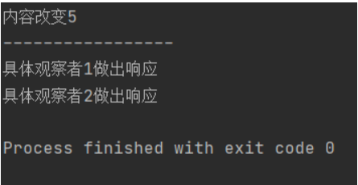
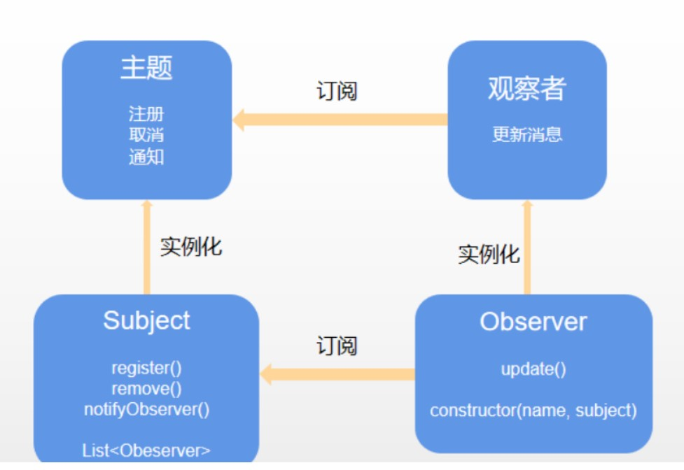
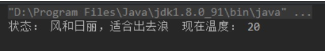
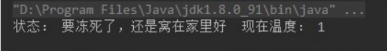

# 开发模式之一   观察者模式

**Java一共有23种开发模式**  观察者模式是软件设计模式的一种。在此种模式中，一个目标对象管理所有相依于它的观察者对象，并且在它本身的状态改变时主动发出通知。这通常透过呼叫各观察者所提供的方法来实现。此种模式通常被用来实现事件处理系统。

当对象间存在一对多关系时，则使用观察者模式（Observer Pattern）。比如，当一个对象被修改时，则会自动通知依赖它的对象。观察者模式属于行为型模式。

**观察者（Observer）**英式发音：[əbˈzɜːvə]  美式发音：[əbˈzɜːrvər]

**被观察者（subject）**英式发音： [ˈsʌbdʒɪkt , səbˈdʒekt] 美式发音：[ˈsʌbdʒɪkt , səbˈdʒekt]

**总结：**

**观察者定义了一种一对多的依赖关系，让多个观察者对象同时监听某一个主体对象，这个主体对象在状态发生变化时，会通知所有观察者对象，使他们能自动更新自己。**

### 主要解决

一个对象状态改变给其他对象通知的问题，而且要考虑到易用和低耦合，保证高度的协作。

### 何时使用

一个对象（目标对象）的状态发生改变，所有的依赖对象（观察者对象）都将得到通知，进行广播通知。

### 优点

- 观察者和被观察者是抽象耦合的。
- 建立一套触发机制。

### 缺点

- 如果一个被观察者对象有很多的直接和间接的观察者的话，将所有的观察者都通知到会花费很多时间。
- 如果在观察者和观察目标之间有循环依赖的话，观察目标会触发它们之间进行循环调用，可能导致系统崩溃。
- 观察者模式没有相应的机制让观察者知道所观察的目标对象是怎么发生变化的，而仅仅只是知道观察目标发生了变化。

### 使用场景

- 一个抽象模型有两个方面，其中一个方面依赖于另一个方面。将这些方面封装在独立的对象中使它们可以各自独立地改变和复用。
- 一个对象的改变将导致其他一个或多个对象也发生改变，而不知道具体有多少对象将发生改变，可以降低对象之间的耦合度。
- 一个对象必须通知其他对象，而并不知道这些对象是谁。
- 需要在系统中创建一个触发链，A对象的行为将影响B对象，B对象的行为将影响C对象……，可以使用观察者模式创建一种链式触发机制。


### 代码实现

步骤1，创建抽象Subject类

```java
import java.util.ArrayList;
import java.util.List;

public abstract class Subject {
    //抽象类
    protected List<Observer> observers = new ArrayList<Observer>();
    //增加观察者方法
    public void add(Observer observer){
        observers.add(observer);
    }
    //删除观察者的方法
    public void remove(Observer observer){
        observers.remove(observer);
    }
    //通知观察者的方法
    public abstract void notifyObserver(String sum);

}
```

步骤2，创建 Observer 接口

```Java
public interface Observer {
    //抽象观察者
    void response();//观察者做出的响应
}

```

步骤3，创建具体被观察类

```java
public class ConcreteSubject extends Subject{
    @Override
    public void notifyObserver(String sum) {
        //具体目标
        System.out.println("目标发生改变 "+sum);
        System.out.println("-----------------");
        //因为对象被放入集合中，所以循环调用每个对象的响应的方法
        for(Object obs:observers){
            ((Observer) obs).response();
        }
    }
}
```

步骤4，创建观察者类1

```java
public class ConcreteSubject1 implements Observer{
    //具体观察者1
    @Override
    public void response() {
        System.out.println("具体观察者1做出响应");
    }
}

```

步骤5，创建观察者类2

```java
public class ConcreteSubject2 implements Observer{
    @Override
    public void response() {
        System.out.println("具体观察者2做出响应");
    }
}

```

测试类

```java
public class Demo {
    public static void main(String[] args){
        Subject subject = new ConcreteSubject();
        Observer observer1 = new ConcreteSubject1();
        Observer observer2 = new ConcreteSubject2();
        //添加观察者，这里是将观察者对象直接放入集合
        subject.add(observer1);
        subject.add(observer2);
        //通知观察者
        subject.notifyObserver("5");
    }
}

```

执行结果:



主题（Subject）具有注册和移除观察者、并通知所有观察者的功能，主题是通过维护一张观察者列表来实现这些操作的。

观察者（Observer）的注册功能需要调用主题的 registerObserver() 方法。



在观察者模式，我们又分为**推模型**和**拉模型**两种方式。

## **推模型**

主题对象向观察者推送主题的详细信息，不管观察者是否需要，推送的信息通常是主题对象的全部或部分数据。

**1.定义一个被观察者的实现类WeatherData 。**

```java
public class WeatherData extends Observable {

    private int temperature;//温度

    public int getTemperature() {
        return temperature;
    }

    public void setTemperature(int temperature) {
        this.temperature = temperature;
        this.setChanged();
        this.notifyObservers(temperature);
    }
}
```

**notifyObservers源码：**

```java
public void notifyObservers(Object arg) {
        Object[] arrLocal;

        synchronized (this) {
            //如果changed为
            if (!changed)
                return;
            arrLocal = obs.toArray();
            clearChanged();
        }

        for (int i = arrLocal.length-1; i>=0; i--)
            ((Observer)arrLocal[i]).update(this, arg);
    }
```

**2.定义一个观察者的实现类CurrentConditionsDisplay**

```java
public class CurrentConditionsDisplay extends Observable implements Observer {
    @Override
    public void update(Observable o, Object arg) {
        this.displayTemperature(Integer.parseInt(arg.toString()));
    }

    private String status;

    public String getStatus() {
        return status;
    }

    public void setStatus(String status) {
        this.status = status;
    }

    private void displayTemperature(int temperature) {
        if (temperature <= 18) {
            this.setStatus("要冻死了，还是窝在家里好");
        }else if(temperature > 18 && temperature < 30){
            this.setStatus("风和日丽，适合出去浪");
        }else{
            this.setStatus("太晒了，都给我晒糊了");
        }
        System.out.println("状态： " + status + "  现在温度： " + temperature);
    }
}
```

**接下来我们定义我们的测试类PullDemo ：**

```java
public class PullDemo {

    public static void main(String[] args) {
        WeatherData weatherData = new WeatherData();
        //添加一个观察者
        weatherData.addObserver(new CurrentConditionsDisplay());
        //天气变化
        weatherData.setTemperature(20);
    }
}

```

**运行结果：**



观察者关注被观察者（上文说的主题对象），当被观察的状态发生变化，温度发生变化，会通知被观察对象CurrentConditionsDisplay 来展示被观察者的状态变化的值。

## **拉模型**

主题对象在通知观察者的时候，只传递少量信息。如果观察者需要更具体的信息，由观察者主动到主题对象中获取，相当于是观察者从主题对象中拉数据。一般这种模型的实现中，会把主题对象自身通过update()方法传递给观察者，这样在观察者需要获取数据的时候，就可以通过这个引用来获取了

**1.定义一个被观察者的实现类WeatherData 。**

```java
public class WeatherData extends Observable {

    private int temperature;//温度

    public int getTemperature() {
        return temperature;
    }

    public void setTemperature(int temperature) {
        this.temperature = temperature;
        this.setChanged();
        this.notifyObservers();
    }
}
```

**2.定义一个观察者的实现类CurrentConditionsDisplay**

```java
public class CurrentConditionsDisplay extends Observable implements Observer {
    @Override
    public void update(Observable o, Object arg) {
        this.displayTemperature(((WeatherData) o).getTemperature());
    }

    private String status;

    public String getStatus() {
        return status;
    }

    public void setStatus(String status) {
        this.status = status;
    }

    private void displayTemperature(int temperature) {
        if (temperature <= 18) {
            this.setStatus("要冻死了，还是窝在家里好");
        }else if(temperature > 18 && temperature < 30){
            this.setStatus("风和日丽，适合出去浪");
        }else{
            this.setStatus("太晒了，都给我晒糊了");
        }
        System.out.println("状态： " + status + "  现在温度： " + temperature);
    }
}
```

**测试类PullDemo ：**

```java
public class PullDemo {

    public static void main(String[] args) {
        WeatherData weatherData = new WeatherData();
        //添加一个观察者
        weatherData.addObserver(new CurrentConditionsDisplay());
        //天气变化
        weatherData.setTemperature(1);
    }
}

```

**测试结果：**



会通知被观察对象CurrentConditionsDisplay 来展示被观察者的状态变化的值。


### **<font style = "color:red">注意事项</font>**

1. JAVA 中已经有了对观察者模式的支持类
2. 避免循环引用
3. 如果顺序执行，某一观察者错误会导致系统卡壳，一般采用异步方式